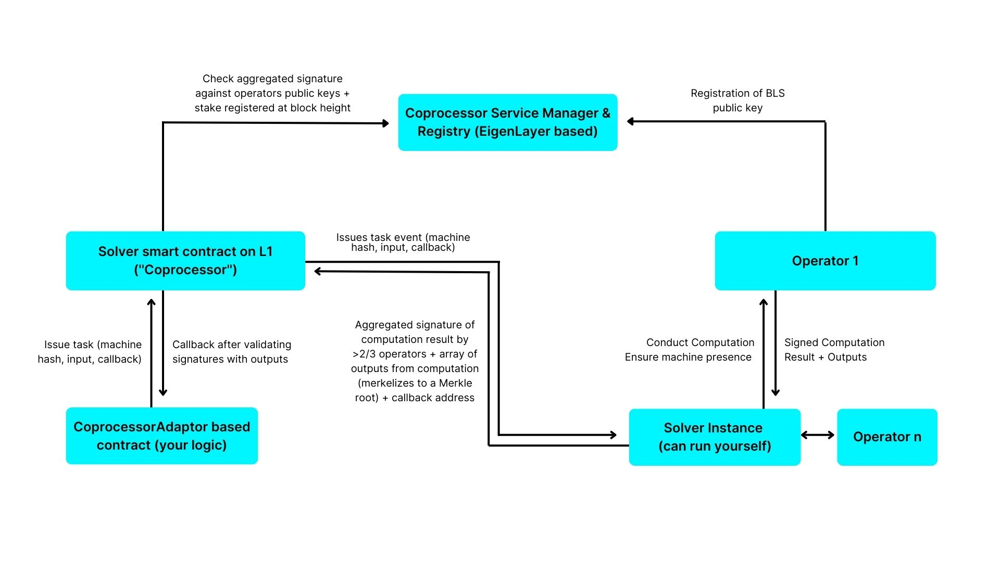
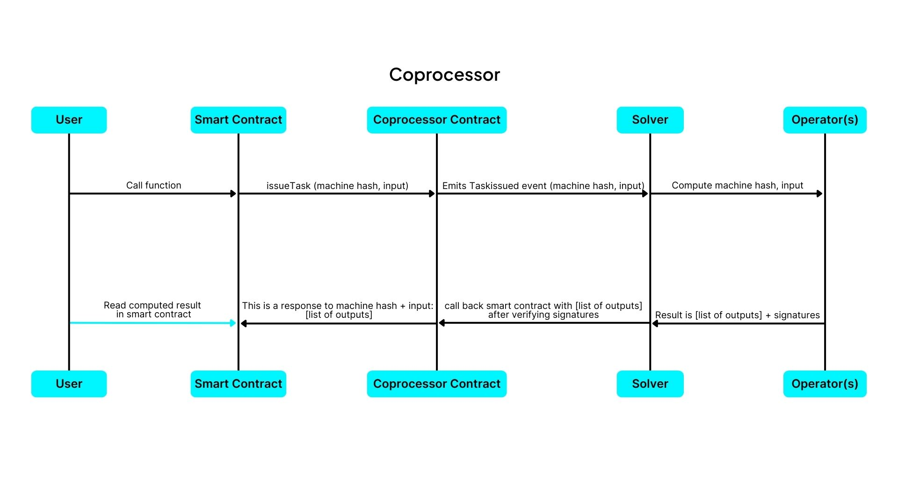

# Architecture

The Cartesi Coprocessor Architecture is designed to enable processing complex computations in specialized computers off-chain. Through the integration of a new layer called Coprocessors, complex application logics can be run externally by these special computers (coprocessors) while maintaining the state of the application on-chain. This integration is composed of two major components: the on-chain layer and the off-chain layer.

### On-chain components

The on-chain components are a set of smart contracts deployed to the base layer, they are the point of contact with regular users interacting with applications deployed to the Cartesi Coprocessor. It is composed of key contracts like:

- **Application smart Contract:** This is a regular smart contract existing on a base layer like Ethereum, it contains logic to request for certain executions to be executed off-chain. It's also designed to receive and handle the result of these executions according to a developer's specification.

- **Coprocessor Contract:** This is a single contract deployed to the base layer, it contains functions that can be called by any application smart contract to request for executions, it's designed to receive requests from application contract, relay these request to the off-chain components of the Coprocessor then receive the results of these requests and forward them back to the application which requested them.

### Off-Chain components

The off-chain components are a collection of external components consisting of servers and also specialized machines called operators which execute operations on request.

- **Solver:** This is an off-chain component of the Coprocessor integration it's a specialized server which listens to the Coprocessor contract for emitted events. These events contain requests for external computation, where it relays your request to these specialized machines called operators which would execute your request, it's also tasked with making sure that the operators have the developer defined logic with which to execute the request from the on-chain components. After a successful operation, the solver finally signs and sends the result of these operations along with an aggregated signature from the operators on-chain to the Coprocessor contract.

- **Operators:**
  Operators are a network of specialized machines that execute complex operations using predefined user logic. They do not maintain program state but perform tasks when called and return the results to the caller. Operators are incentivized with tokens based on operation complexity. Currently, the Cartesi Coprocessor integration utilizes operators on the EigenLayer.

